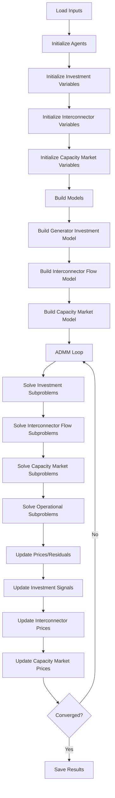

```mermaid
graph TD
    A[Load Inputs] --> B[Initialize Agents]
    B --> B1[Initialize Investment Variables]
    B1 --> B2[Initialize Interconnector Variables]
    B2 --> B3[Initialize Capacity Market Variables]
    B3 --> C[Build Models]
    
    C --> C1[Build Generator Investment Model]
    C1 --> C2[Build Interconnector Flow Model]
    C2 --> C3[Build Capacity Market Model]
    C3 --> D[ADMM Loop]
    
    D --> D1[Solve Investment Subproblems]
    D1 --> D2[Solve Interconnector Flow Subproblems]
    D2 --> D3[Solve Capacity Market Subproblems]
    D3 --> E[Solve Operational Subproblems]
    
    E --> F[Update Prices/Residuals]
    F --> F1[Update Investment Signals]
    F1 --> F2[Update Interconnector Prices]
    F2 --> F3[Update Capacity Market Prices]
    F3 --> G{Converged?}
    
    G -->|Yes| H[Save Results]
    G -->|No| D
```